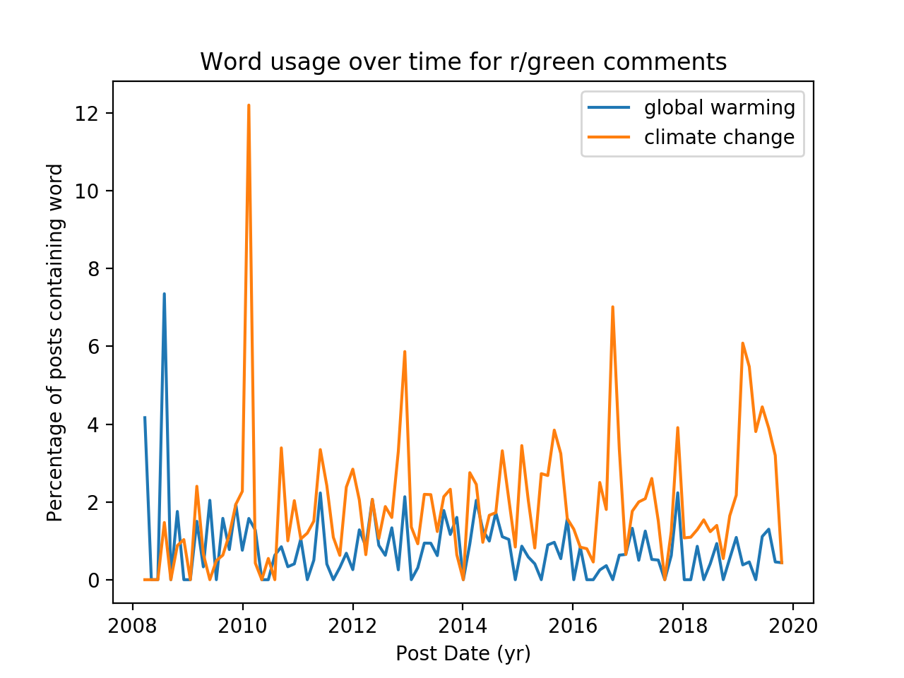

# Analyzing Climate Change Discourse and Communities on Reddit

## Introduction

In this project, we set out to explore climate skepticism as it manifests on [Reddit](https://www.reddit.com/). Our goals for this project are two-fold:

 1. Gain a deeper understanding of climate skepticism in a data-driven way
 2. Empower others to use Reddit data for research

## Background

The role of humans in climate change was predicted over 100 years ago by Svante Arrhenius [[ref]](https://www.rsc.org/images/Arrhenius1896_tcm18-173546.pdf), and since then a formidable body of scientific evidence has accumulated leading over 97% of scientists to conclude that human activity has a significant impact on the climate [[ref]](https://skepticalscience.com/global-warming-scientific-consensus-intermediate.htm). An ever-improving collection of climate models even allow us to estimate the exact degree to which we will cause the planet to warm, and the details of how this will impact specific ecosystems and industries. Increasingly, these predictions are being validated by an increase in extreme weather events, collapsing ecosystems, and warming temperatures around the globe.

Despite the overwhelming evidence of anthropogenic global warming (AGW), in general we have been incredibly slow to take significant action to mitigate our impact on the climate. There are **many** factors contributing to this hesitation — one of which is widespread skepticism or denial of the reality of AGW. For certain individuals and companies (most notably fossil-fuel industries), avoiding climate action is a profitable strategy in the short term. As a result, they have mounted numerous campains to spread misinformation and discredit climate science [[ref]](https://www.merchantsofdoubt.org/).

Moving the needle on climate action will likely require us to convince climate skeptics of the reality and severity of this issue. Before we can do so effectively, it is critical to understand why and how people deny AGW. This is by no means a novel research endevour, and we discuss a number of related studies in the [Related Work](#-related-work) section.


## Pushshift API

Reddit is special among the large social-media platforms in that it provides a free, extensive API for interacting with content on the platform. The API exposes nearly all the functionality that a regular user would have when browsing reddit.


The pushshift API has two active endpoints, which can be found at:

1. Comment Endpoint: <https://api.pushshift.io/reddit/search/comment>
2. Submission Endpoint: <https://api.pushshift.io/reddit/search/submission>

Try following these links and inspect the results in your browser. For the comments endpoint, you should see something like this:

```JSON
{
    "data": [
        {
            "all_awardings": [],
            "approved_at_utc": null,
            "associated_award": null,
            "author": "12UglyTacos",
            "author_flair_background_color": null,
            "author_flair_css_class": null,
            "author_flair_richtext": [],
            "author_flair_template_id": null,
            "author_flair_text": null,
            "author_flair_text_color": null,
            "author_flair_type": "text",
            "author_fullname": "t2_g0vwsy8",
            "author_patreon_flair": false,
            "author_premium": false,
            "awarders": [],
            "banned_at_utc": null,
            "body": "Good luck girl! Let us know how you do! \n\n&lt;3",
            "can_mod_post": false,
            "collapsed": false,
            "collapsed_because_crowd_control": null,
            "collapsed_reason": null,
            "created_utc": 1575947859,
            "distinguished": null,
            "edited": false,
            "gildings": {},
            "id": "facv822",
            "is_submitter": true,
            "link_id": "t3_e72kna",
            "locked": false,
            "no_follow": true,
            "parent_id": "t1_f9xve3h",
            "permalink": "/r/entwives/comments/e72kna/decided_my_2020_resolution_was_to_learn_to_french/facv822/",
            "retrieved_on": 1575947860,
            "score": 1,
            "send_replies": true,
            "steward_reports": [],
            "stickied": false,
            "subreddit": "entwives",
            "subreddit_id": "t5_2s7a6",
            "total_awards_received": 0
        },
        ...
```

As we can see from the JSON result, each comment has a lot of associated information that might be useful to us. Here are some of the fields that stand out as particularly useful:

*  `"body"`: the actual text of the comment
*  `"author"`: the username of the user who submitted the comment
*  `"subreddit"`: the subreddit that the comment is in
*  `"created_utc"`: a unix timestamp indicating when the comment was created

The result returned by the submission endpoint has a similar structure, but with different fields for each submission. Here's a descripton of some of the relevant fields for each submission:

*  `"title"`: the title of the submission
*  `"selftext"`: the body of text inside the submission (optional: not all submissions have selftext)
*  `"domain"`: the domain of a website that the submission links to (optional: not all submissions have domains)
*  "`subreddit_subscribers`": the number of members in the subreddit of this submission
*  `"author"`: the username of the user who submitted the submission
*  `"subreddit"`: the subreddit that the comment is in
*  `"created_utc"`: a unix timestamp indicating when the submission was created


If we go to <https://api.pushshift.io/meta>, we'll see that the Pushshift API has a rate limit of 120 requests per minute - that's one every 0.5 seconds. Therefore, we will want to slow our requests down by waiting 0.5 seconds between requests.

The pushshift API caps the number of results returned for a single request to 1000. Each result contains data about either a comment or a submission depending on the endpoint queried.


## Experiments

### Making Simple Queries

Let's start by using python to programatically make a request.

First, we'll want to import python's `requests` library for making API requests, as well as the `time` library so that we can make sure not to exceed the Pushshift API's rate limit.
```python
import requests
import time
```

Now, let's write a function called `query` which takes in as input the name of the endpoint, which should be `"comment` or `"submission"`, as well as a dictionary of query parameters. The function should query the endpoint with the given parameters and return the result as a list of dictionaries.

```python
def query(endpoint, params):
    
    params_string = "&".join(f"{param}={val}" for param,val in params.items())
    url = f"https://api.pushshift.io/reddit/search/{endpoint}/?{params_string}"

    r = requests.get(url = url)
    data = r.json()
    return data["data"]
```
This works great if we want up to 1000 results, but if we try to ask for more than 1000 results, this will not work because of pushshift's size limit. This means that we'll have to make multiple requests until we have the desired number of results. For example, if we want to get 2500 results, then we can make 3 API calls, querying for 1000 results in the first 2, and 500 results in the third.

We'll also want to call time.sleep with an argument of 0.5 to tell python to wait 0.5 seconds after each request.

```python
def query_n(endpoint, params, n = 1000):
    params.update({"sort_type": "created_utc", "sort":"desc", "size":n})

    results = []
    while len(results) < n:
        query_res = query(endpoint, {**params, "before": results[-1]["created_utc"] if results else int(time.time()) })
        if not query_res:
            return results)
        results.extend(query_res)
        time.sleep(0.5)
    return results
```

Great! Now that we know how to make requests, let's dive into the data.

### Topic Modelling


### Clustering

### Word usage trends




### Linking

### Sentiment Analysis

## Discussion

## Related Work

